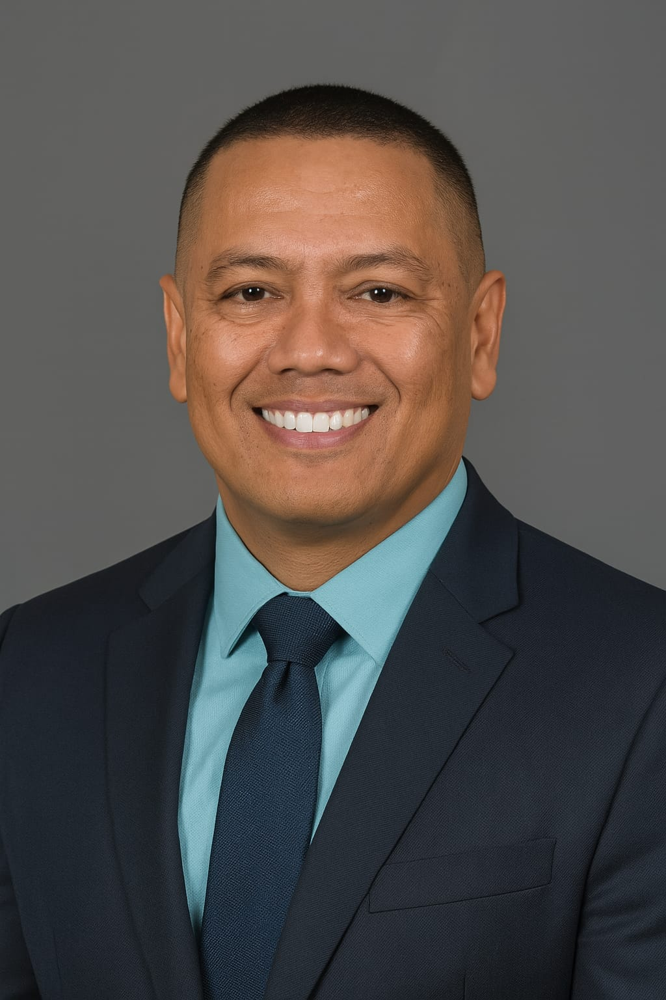

## Salleh Ahshim

**I build things. Then I protect them.**

After 15 years as a mechanical design engineer, I have 
spent the past three years repositioning at the 
intersection of cloud engineering, cybersecurity, and 
AI governance — where the most important questions are 
no longer just technical. They are about ownership, 
protection, and accountability.

---

### What I Am Building

**GRC.AD — AI Governance & IP Strategy Brand**

Original analysis on AI governance and cybersecurity 
through an IP lens. My LinkedIn series — *AI & Cyber 
Through a GRC Lens* — covers AI output ownership, 
trade secret protection of governance architectures, 
and copyright risk in AI deployment under Singapore's 
Copyright Act 2021.

Building toward an independent advisory practice and 
SaaS platform — **GRC.CX** — serving technology 
companies navigating AI IP risk in Singapore.

**FoldiePro™ — Live IP Execution**

Performance optimisation system for folding bicycles, 
built as an IP system from day one. Trademark filed 
under Class 12. Core optimisation logic structured as 
trade secret. Data layer designed as proprietary 
intellectual asset.

**Salleh Cyber Risk Lab**

Independent research lab exploring AI agent governance. 
Zero-Trust AI Agent Governance Framework, prompt 
injection boundary testing, and original IP analysis 
under Singapore law.

[View on GitHub](https://github.com/Sahshim/salleh-cyber-risk-lab)

---

### Credentials

- Master of IP and Innovation Management (Candidate) 
— Singapore University of Social Sciences (SUSS)
- SCTP Cloud Administration — NTUC LearningHub
- SCTP IT/Cybersecurity Risk Analysis — NTUC LearningHub
- ITIL 4 Foundation
- PDPA Certified
- Certified Personal Trainer (NCSF)

---

### Connect

- LinkedIn: [linkedin.com/in/sallehehshim](https://linkedin.com/in/sallehehshim)
- GitHub: [github.com/Sahshim](https://github.com/Sahshim)
- GRC.CX: [grc.cx](https://grc.cx)
- X: [@salleh](https://x.com/salleh)

---

*"I am not just building products. I am building IP systems."*
